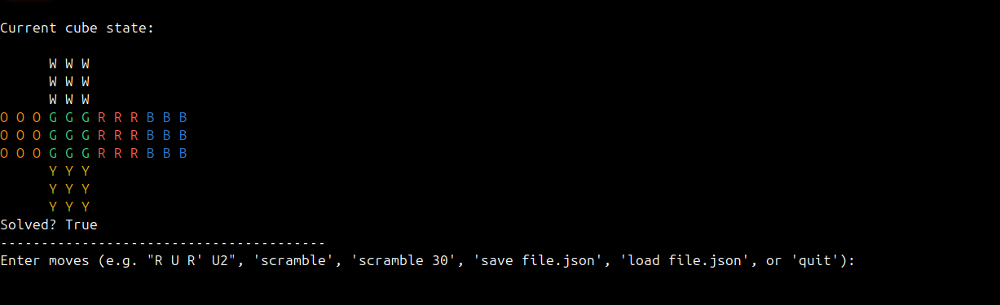

# Rubik's Cube 3×3 CLI

A full-featured Python command-line Rubik's Cube 3×3 simulator written in pure Python.

## Demo



---

## ✨ Features

### Cube simulation
- Full 3×3 cube state representation  
- All basic face moves: `U`, `D`, `F`, `B`, `L`, `R` (including `'` and `2`)  
- Whole-cube rotations: `y`, `y'`, `y2`  
- Random scramble generator  
- Check if the cube is solved  

### State management
- Save cube state to JSON (`save state.json`)  
- Load cube state from JSON (`load state.json`)  
- Reset to solved state (`clear`)  
- Export cube as PNG image (`export cube.png`)  

### Interactive shell
- Apply move sequences directly: `R U R' U2`  
- Undo last move (`undo`)  
- View move history (`history`)  
- Built-in help (`help`)  

### User-defined algorithms
- `define name <moves...>` — save a named algorithm  
- `run name` — execute a saved algorithm  
- `algos` — list all saved algorithms  
- `undef name` — delete a saved algorithm  
- `invert <moves...>` — print the inverse of a raw algorithm  
- `invert <name>` — print the inverse of a saved algorithm  

Algorithms are stored persistently in `algos.json`.

### Testing & packaging
- Basic tests using `pytest`  
- Modern `pyproject.toml` using setuptools  
- Installable locally with `pip install .`  
- Provides a CLI command: `rubikscube`

---

## 🚀 Running

From the project root, start the interactive mode:

```bash
python3 main.py
```

If installed via `pip install .`:

```bash
rubikscube
```

---

## 🧠 CLI Examples (non-interactive)

Scramble the cube with 20 moves and print the state:

```bash
python3 main.py --scramble 20 --no-interactive
```

Load state, apply an algorithm, save the result:

```bash
python3 main.py \
  --load state.json \
  --apply "R U R' U'" \
  --save new_state.json \
  --no-interactive
```

---

## 💬 Interactive Mode Commands

When running:

```bash
python3 main.py
```

You can use the following commands:

### Cube moves & scrambling

- `R U R' U2` – apply any move sequence  
- `scramble` – scramble with default length (20 moves)  
- `scramble 30` – scramble with 30 random moves  

### State & history

- `undo` – undo the last move  
- `history` – show all moves performed in this session  
- `clear` – reset cube to solved state  
- `export cube.png` – export the current cube as a PNG image  

### Saving & loading

- `save state.json` – save cube state to a JSON file  
- `load state.json` – load cube state from a JSON file  

### Algorithms

- `define algo R U R' U'` – save algorithm under the name `algo`  
- `run algo` – execute the algorithm `algo` on the cube  
- `algos` – list all saved algorithms  
- `undef algo` – delete the algorithm `algo`  
- `invert "R U R' U'"` – print the inverse of a raw algorithm  
- `invert algo` – print the inverse of the saved algorithm `algo`  

### Other

- `help` – show a summary of available commands  
- `quit`, `exit`, `q` – exit the program  

Notes:
- Moves must be space-separated (e.g. `R U R' U2`).  
- Colors depend on ANSI support of your terminal.

---

## 🧪 Tests

Run tests with:

```bash
pytest
```

---

## 📦 Local installation

Create and activate a virtual environment (recommended):

```bash
python3 -m venv .venv
source .venv/bin/activate
python3 -m pip install --upgrade pip
```

Install the project:

```bash
pip install .
```

After installation, you can run:

```bash
rubikscube
```

to start the CLI.

---

## 📄 JSON State Format Example

```json
{
  "U": ["W","W","W","W","W","W","W","W","W"],
  "D": ["Y","Y","Y","Y","Y","Y","Y","Y","Y"],
  "F": ["G","G","G","G","G","G","G","G","G"],
  "B": ["B","B","B","B","B","B","B","B","B"],
  "L": ["O","O","O","O","O","O","O","O","O"],
  "R": ["R","R","R","R","R","R","R","R","R"]
}
```

---

## 📜 License

MIT
